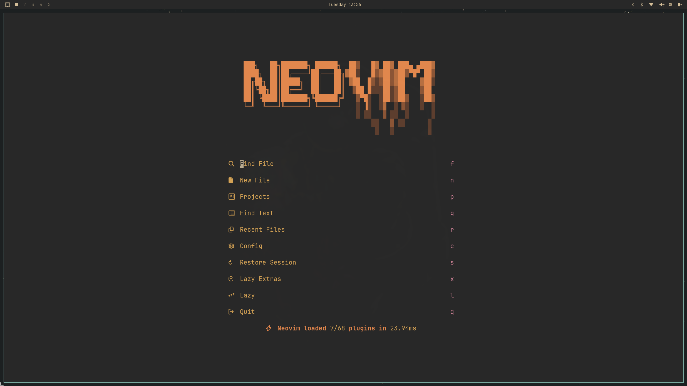
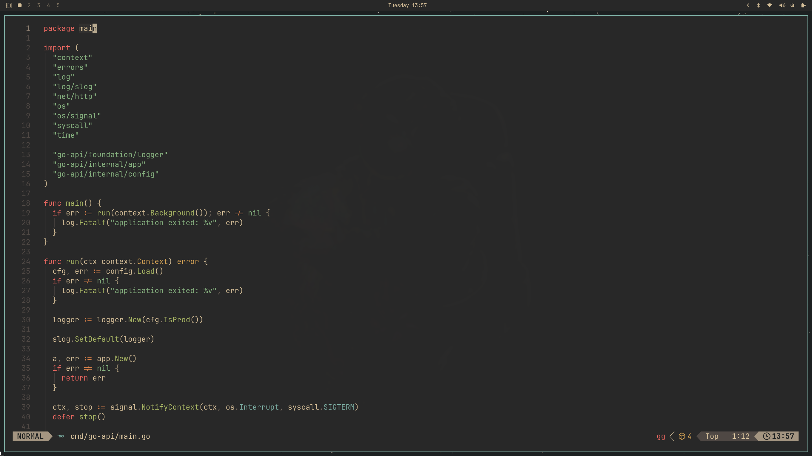
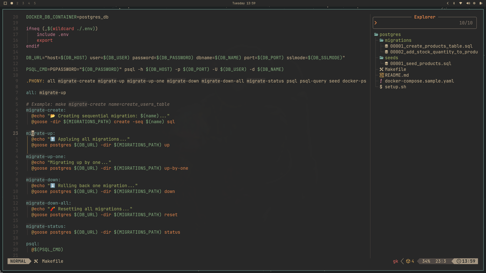
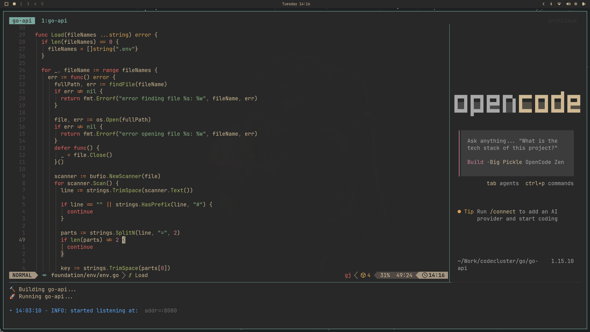
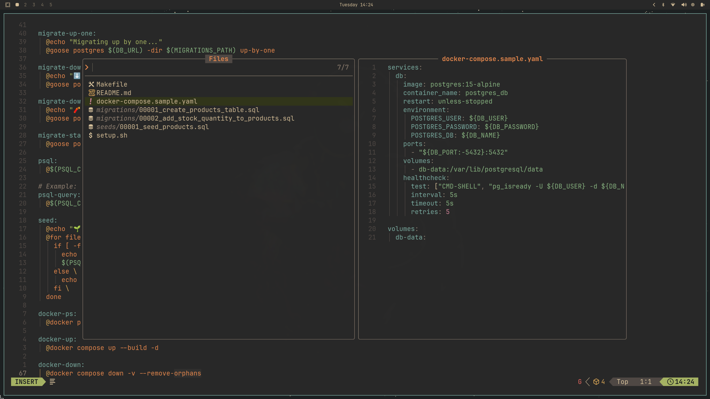

<div align="center">

# 🚀 Neovim Configuration

> _A clean, modular, and performance-oriented Neovim configuration built to streamline your development workflow._

[](https://neovim.io/)
[](https://www.lua.org/)
[](LICENSE)

</div>

---

## 📖 Table of Contents

- [Screenshots](#-screenshots)
- [Features](#-features)
- [Prerequisites](#-prerequisites)
- [Setup & Installation](#️-setup--installation)
- [License](#-license)

---

## 📸 Screenshots

<div align="center">
  
  
  <br>
  
  
  <br>
  
</div>

---

## ✨ Features

- **Modular Architecture:** Organized folder structure for easy maintenance (`lua/plugins/`, `lua/config/`).
- **Automated Setup:** Safe installation script with built-in backup and emergency rollback mechanisms.
- **Performance Focused:** Lazy-loading enabled via [lazy.nvim](https://github.com/folke/lazy.nvim).
- **Custom Keymaps & Autocmds:** Optimized workflow tweaks.
- **Theme Flexibility:** Built-in support for Omarchy with an automated cleanup option.

---

## ⚡ Prerequisites

Before installing, ensure you have the following dependencies:

- **[Neovim](https://neovim.io/)** (>= `0.9.0`)
- **Git**
- A **[Nerd Font](https://www.nerdfonts.com/)** (Optional, but highly recommended for icons)

---

## 🛠️ Setup & Installation

This repository includes a `setup.sh` script designed to safely manage your Neovim configuration migration.

### 1. Installation

Clone the repository and run the setup script:

```bash
git clone https://github.com/tahasadough/nvim-conf.git && cd nvim-conf && chmod +x setup.sh && ./setup.sh
```

### 2. What `setup.sh` does

- **Backup:** Creates a timestamped backup of your existing configuration at `~/.config/nvim.bak.[TIMESTAMP]`.
- **Emergency Cache:** Creates an extra backup in `~/.cache/nvim_config_backup`. This ensures a safe restore point even if you delete your primary backup.
- **Cleanup:** Intelligently installs the new configuration while excluding unnecessary files (like `.git`, images, and the script itself).

### 3. Rollback (Disaster Recovery)

If something goes wrong or you need to restore your previous configuration immediately, you can use the built-in rollback command:

```bash
chmod +x rollback && ./rollback.sh
```

> **Note:** This command will restore your configuration using the **emergency cache** stored in `~/.cache`.

---

## 📜 License

This project is licensed under the [MIT License](LICENSE).
